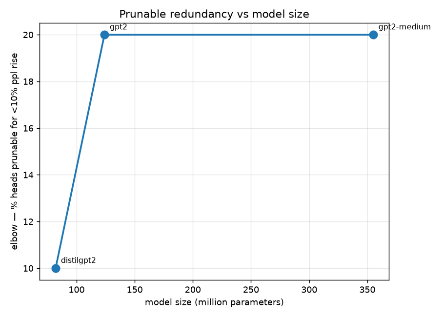
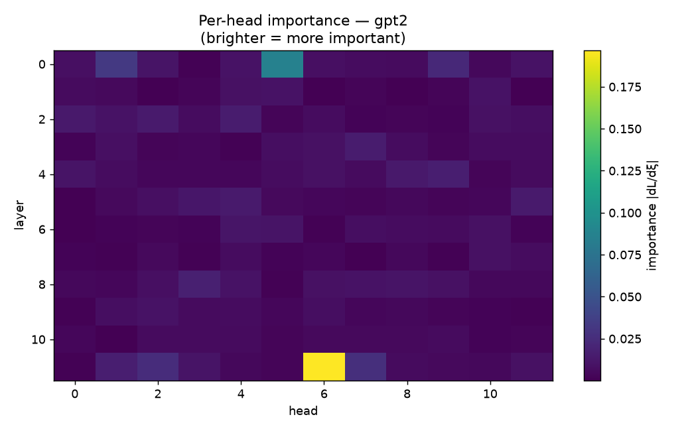

# Attention Head Pruning, From Scratch

**How many of a transformer's attention heads are redundant — and does removing the "unimportant" ones actually beat removing random ones?**

A clean, from-scratch implementation of sensitivity-based attention-head pruning ([Michel, Levy & Neubig, "Are Sixteen Heads Really Better Than One?", NeurIPS 2019](https://arxiv.org/abs/1905.10650)), with an honest accuracy/size frontier and a random-pruning baseline that the method has to beat to justify itself.

Runs on CPU in ~2 minutes on `distilgpt2`. No GPU, no training, no API.

> **This is a reimplementation, not a new method.** The technique is Michel et al. 2019; head pruning is a well-studied area (Voita et al. 2019, and many since). The value here is a clean from-scratch build and an honest analysis — including a baseline and an integrity guard that most tutorial versions skip. It's an engineering-and-analysis artifact, and it's framed as exactly that.

---

## The question

A transformer layer has many attention heads. Michel et al. showed a striking thing: **most of them can be removed with almost no loss** — up to ~20–40% — after which quality collapses. That implies heads are largely redundant, and it suggests a cheap way to shrink a model: score each head's importance, drop the least important, keep the rest.

Two questions this repo answers empirically, on whatever model you point it at:

1. **Where is the elbow?** How many heads prune before perplexity climbs?
2. **Does importance-based pruning actually beat random?** If dropping the "least important" heads is no better than dropping random heads, the importance score is theatre. The gap between the two curves is the whole justification for the method.

## The method

Each head `h` gets a gate `ξ_h` (=1 in the live model). Its importance is how sensitive the loss is to that gate:

```
I_h = E |∂L / ∂ξ_h|
```

One backward pass over an eval batch scores every head at once. Then remove the lowest-scoring heads (never emptying a layer — that's a harsher intervention that would confound the curve) and measure the loss.

`structured`, not `sparse`: this removes **whole heads**, so the parameters genuinely leave and inference genuinely speeds up — unlike zeroing individual weights, which leaves a model the same size on normal hardware. Since the goal is *lower resources*, structured pruning is the only kind that delivers it.

## Results

Two models, and the contrast between them *is* the finding.

### GPT-2 (full-size, 12 layers × 12 heads = 144 heads)

| fraction pruned | importance ppl | random ppl | gap |
|---:|---:|---:|---:|
| 0% | 48.3 | 48.3 | — |
| 10% | 49.5 | 51.3 | +1.7 |
| 20% | 51.9 | 53.3 | +1.4 |
| 30% | 53.6 | 55.3 | +1.6 |
| 40% | 59.8 | 62.7 | +2.8 |
| 50% | 64.1 | 81.9 | **+17.7** |
| 60% | 75.2 | 103.5 | **+28.3** |
| 70% | 113.5 | 153.5 | **+39.9** |
| 80% | 189.9 | 370.7 | **+180.9** |

Importance-based pruning beats the random baseline on **8 of 9 fractions**, and the gap *widens* as pruning deepens. **Elbow at 20%:** a fifth of GPT-2's heads can be removed for under a 10% perplexity rise. This is the Michel et al. result, reproduced from scratch: heads are substantially redundant, and knowing *which* to cut matters more and more the harder you cut.

### DistilGPT-2 (distilled, 6 layers × 12 heads = 72 heads)

| fraction pruned | importance ppl | random ppl | gap |
|---:|---:|---:|---:|
| 0% | 66.9 | 66.9 | — |
| 10% | 70.0 | 71.3 | +1.4 |
| 20% | 75.1 | 74.1 | **−1.0** |
| 30% | 86.3 | 79.8 | **−6.6** |
| 40% | 93.9 | 87.6 | **−6.3** |
| 50% | 106.3 | 99.1 | **−7.2** |
| 60% | 132.5 | 134.3 | +1.9 |
| 70% | 191.2 | 198.8 | +7.6 |
| 80% | 302.5 | 574.4 | **+271.8** |

Here importance-based pruning wins on only **4 of 9 fractions**, and in the 20–50% range it actually *loses* to random. Discrimination is lower (score spread 1.04 vs GPT-2's 2.18).

### Why the two differ — the actual finding

**DistilGPT-2 is already distilled.** Distillation is itself a compression step that squeezes redundancy out of the network. By the time you try to prune it, there's little redundant capacity left to find, so head-importance has a weak, noisy signal in the mid-range — and noise can lose to random. GPT-2, full-size, still carries the redundancy Michel described, so importance-based pruning has real slack to exploit and beats random cleanly.

The one place they agree is the deep end (80%): when you're forced to cut most of the heads, importance-based selection keeps roughly twice the quality of random on *both* models (GPT-2 190 vs 371; DistilGPT-2 303 vs 574). Choosing well matters most when you can least afford a wrong cut.

**The takeaway isn't "pruning works."** It's: *pruning-by-importance only beats random when there's redundancy left to find, and an already-compressed model is exactly where it doesn't.* The random baseline is what makes that visible — without it, DistilGPT-2's rising-perplexity curve would look like a normal pruning result instead of the near-null it is.

## Beyond the original: two analyses Michel et al. didn't run

### Does prunable redundancy scale with model size? (`run_ladder.py`)

The two-model contrast above hints that bigger, less-compressed models have more redundancy to prune. `run_ladder.py` turns the hint into a measurement: it runs the sweep across a size ladder (distilgpt2 → gpt2 → gpt2-medium → …) and plots the **elbow — the fraction of heads prunable for free — against model size**.

```bash
python run_ladder.py                              # distilgpt2, gpt2, gpt2-medium
python run_ladder.py --models distilgpt2,gpt2,gpt2-medium,gpt2-large
```



**Result across the ladder:**

| model | params | total heads | discrimination | elbow | importance wins |
|---|--:|--:|--:|--:|--:|
| distilgpt2 | 82M | 72 | 1.04 | 10% | 4/9 |
| gpt2 | 124M | 144 | 2.18 | 20% | 8/9 |
| gpt2-medium | 355M | 384 | 1.68 | 20% | 8/9 |

The clear signal is the **distilled outlier**: distilgpt2 has the lowest elbow (10%), the lowest discrimination, and importance barely beats random (4/9) — exactly what "distillation already spent the redundancy" predicts. Both full-size models sit well above it: 20% elbow, importance winning 8/9.

**Stated honestly, this is a two-regime result, not a smooth scaling law.** gpt2 and gpt2-medium share the same 20% elbow, so these three points don't show "bigger = monotonically more prunable" — they show *distilled models prune less than full models, and among full models the elbow is similar at this grid resolution*. The fraction grid here is coarse (10% steps); a finer sweep might separate gpt2 from gpt2-medium, or might confirm the plateau. Claiming a clean scaling trend from two tied points would overreach — the defensible claim is the distillation effect, which is unambiguous.

### Where do the prunable heads live? (`profile_layers.py`)

Michel reports *how many* heads are redundant. This shows *where*. Same importance scores, two extra views: a per-head importance **heatmap** (layer × head), and a per-layer **survival profile** — at a global prune, which layers keep their heads and which get emptied.

```bash
python profile_layers.py --model gpt2
```



**Result on GPT-2 (at a global 50% prune):** pruning is strongly non-uniform across depth. Layer 0 is the most pruning-resistant — 83% of its heads survive, the pruner barely touches it — while the upper-middle layers 7 and 10 keep only 25%.

| layer | 0 | 1 | 2 | 3 | 4 | 5 | 6 | 7 | 8 | 9 | 10 | 11 |
|---|--:|--:|--:|--:|--:|--:|--:|--:|--:|--:|--:|--:|
| heads kept (of 12) | 10 | 4 | 8 | 7 | 8 | 4 | 6 | 3 | 7 | 5 | 3 | 7 |
| survival | 83% | 33% | 67% | 58% | 67% | 33% | 50% | 25% | 58% | 42% | 25% | 58% |

The reading: the **input layer's** attention is the least redundant — every head there is pulling weight on the raw token/position encoding, so there's little to spare. By the **upper-middle layers**, many heads do overlapping refinement, and three-quarters can go. A single pruning curve hides this; the layer profile shows the model doesn't distribute redundancy evenly, and *where* you prune matters as much as *how much*.

## Measurement integrity

One guard carries the whole repo: **`check_discrimination`**.

Sensitivity-based importance fails silently in a specific way. If the eval text is trivial, or the model is degenerate, or the gate isn't wired to the loss, the gradients come back near-zero and near-uniform — every head scores about the same. The pipeline still runs: it ranks heads, prunes some, plots a curve. But the ranking is arbitrary, so "prune least important" is really "prune random," and every number is noise.

The guard refuses to proceed when the importance scores don't actually spread (`std/mean` below a threshold). This isn't hypothetical — the first prototype hit exactly this: a tiny model trained to memorise its data gave **zero gradient on every head**, and without the guard it would have produced a clean-looking, entirely meaningless frontier. The random-pruning baseline is the second line of defence: if importance can't beat random, the scores are worthless, and the run reports how many fractions it won on.

## Reproducing

```bash
pip install -r requirements.txt
python run.py                                   # distilgpt2, CPU, ~2 min
python run.py --model gpt2 --device cuda        # bigger model, GPU
python -m pytest tests/                         # 10 tests
```

`run.py` computes head importance, runs the discrimination guard, sweeps pruning fractions, compares against a random baseline, finds the elbow, and writes `results/`.

## Limitations

**Mask-based, not physically excised.** Pruning is applied as a head mask — the head still exists but is gated to zero. This measures the *accuracy* effect of removal exactly; the reported parameter/FLOP savings are what physical removal *would* yield. Actually deleting the head dimensions from the weight matrices is a mechanical follow-up; the mask gives the honest quality curve without it. Latency numbers are therefore an upper bound on the pruned model's real speed, and are labelled as such.

**No fine-tuning after pruning.** Michel et al. and most follow-ups *retrain* briefly after pruning to recover some of the lost accuracy, which pushes the elbow further. This repo measures pruning *without* recovery — the harder, more honest number. Adding a fine-tune step would improve every result and is noted as future work, not quietly assumed.

**Importance from one eval batch.** The scores depend on the text they're computed on. A larger, more representative eval set gives more stable importance; a single paragraph is a starting point, not a final measurement.

**Single model, single seed per run.** The random baseline uses one seed. Averaging several would tighten the comparison.

## Future work

- Physically excise pruned heads (resize the weight matrices) and measure real latency/memory, not the masked upper bound.
- Add post-pruning fine-tuning and measure how far it pushes the elbow.
- Compare importance criteria: sensitivity (this repo) vs. Voita et al.'s L0-gate method vs. attention-confidence.
- Larger, held-out eval corpus for stabler importance scores.

## Layout

```
prune/importance.py   Michel-style head importance + the discrimination guard
prune/pruner.py       structured prune-mask construction + measurement
run.py                single-model sweep: importance -> prune -> frontier vs random
run_ladder.py         multi-model sweep: elbow vs model size (redundancy scaling)
profile_layers.py     per-layer survival profile + per-head importance heatmap
results/              frontier CSVs, ladder, layer profiles, figures
```

## References

> Paul Michel, Omer Levy, Graham Neubig. **Are Sixteen Heads Really Better than One?** NeurIPS 2019. [arXiv:1905.10650](https://arxiv.org/abs/1905.10650)

Related: Voita et al., "Analyzing Multi-Head Self-Attention" (ACL 2019), an L0-gate pruning method that complements the sensitivity approach used here.

**Theirs:** the sensitivity-based importance score and the redundancy finding.
**Here:** a from-scratch implementation, a random baseline, an integrity guard against meaningless scores, and the frontier reproduced on small models anyone can run on a laptop.

## License

MIT
